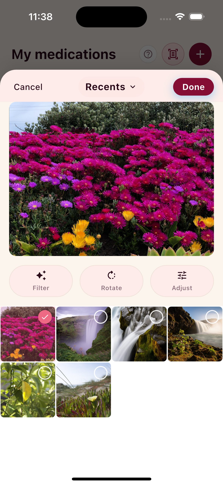
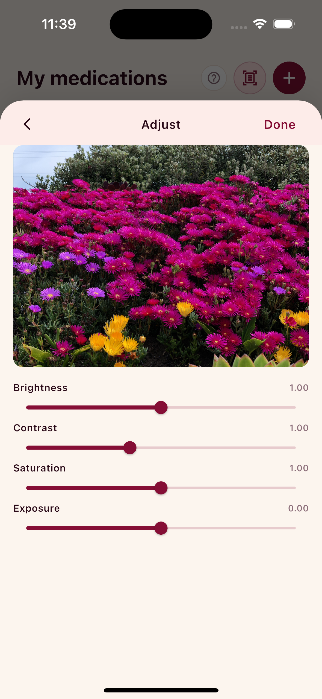
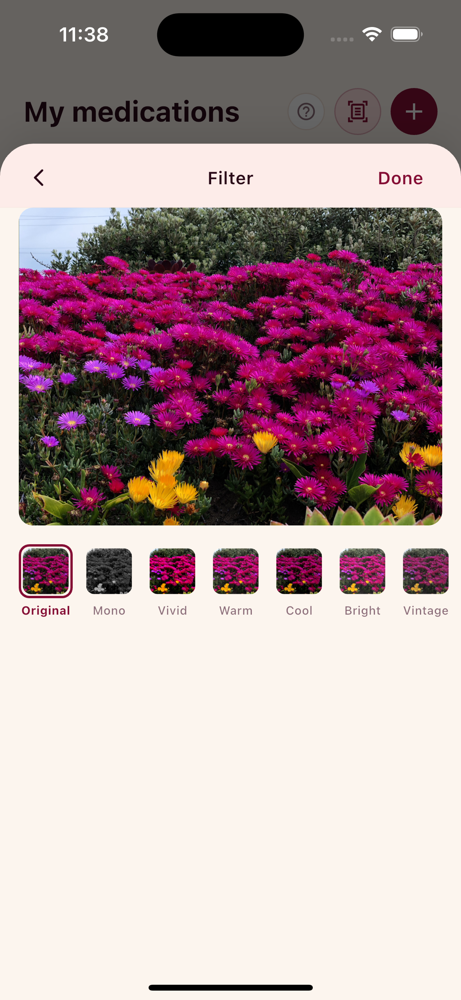
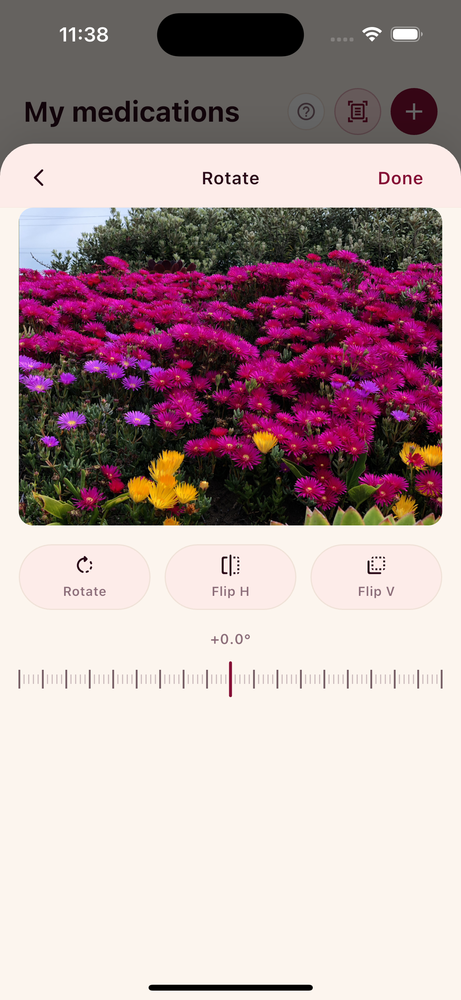

# HaptPhotoPicker

[](https://pub.dev/packages/hapt_photo_picker)
[](LICENSE)

An Instagram-grade photo picker for Flutter with **full token theming**,
**multi-language strings**, **choreographed haptics**, and a
**pluggable post-processing pipeline**.

<p align="center">
  
  
  
  
</p>
<p align="center">
  <em>Gallery · Crop · Filter · Rotate (Adjust + more in <a href="doc/screenshots/">doc/screenshots/</a>)</em>
</p>

## Install

The package is on pub.dev — that's the recommended path:

```sh
flutter pub add hapt_photo_picker
```

Or pin it explicitly in `pubspec.yaml`:

```yaml
dependencies:
  hapt_photo_picker: ^0.8.0
```

### Alternative: depend straight from git

For users who want the bleeding-edge `main` branch (between
releases) or need to verify a fix before it ships to pub.dev:

```yaml
dependencies:
  hapt_photo_picker:
    git:
      url: https://github.com/HaptForge/HaptPhotoPicker.git
      ref: main          # or a specific tag like `v0.8.0`
```

Then in either case:

```sh
flutter pub get
```

Don't forget the [platform setup](#platform-setup) — the picker
delegates to `photo_manager`, which gates on the OS permission
descriptions.

## Quick start

```dart
final results = await HaptPhotoPicker.pick(
  context,
  config: const HaptPickerConfig(
    maxSelection: 4,
    mediaType: HaptMediaType.image,
  ),
);
if (results != null) {
  for (final r in results) {
    final bytes = r.processedBytes ?? await r.asset.readBytes();
    // do something with bytes
  }
}
```

That's it. Defaults ship Instagram-style chrome + English copy.

## Customization

Every visual / textual / behavioural axis is a parameter. Pass
overrides into `HaptPhotoPicker.pick(...)` — there are no globals.

### Theming — token overrides

```dart
final myTheme = HaptPickerTheme.light().copyWith(
  colors: HaptPickerTheme.light().colors.copyWith(
    primary: const Color(0xFF850E35),
    selectionBadge: const Color(0xFFEE6983),
    selectionOverlay: const Color(0x33EE6983),
  ),
  typography: HaptPickerTypography.fromFamily('Inter'),
  radii: const HaptPickerRadii(thumbnail: 6, cropFrame: 12),
);
```

Token bundles you can override independently:

| Bundle | Slots |
|---|---|
| `HaptPickerColors` | surface, primary, selectionBadge, cropFrame, … (17 slots) |
| `HaptPickerTypography` | title, body, label, button, badge |
| `HaptPickerSpacing` | xxs / xs / sm / md / lg / xl + gridGutter |
| `HaptPickerRadii` | thumbnail, cropFrame, button, sheet, badge |
| `HaptPickerShadows` | sheet, button, badge — lists of `BoxShadow` |

### Strings — full multi-language

9 locales ship built-in: `en`, `vi`, `es`, `fr`, `de`, `pt`, `ja`,
`ko`, `ar`. Pass any of them:

```dart
HaptPhotoPicker.pick(context, strings: const HaptPickerStringsVi());
```

To ship your own copy or a 10th language, subclass `HaptPickerStrings`:

```dart
class MyStrings extends HaptPickerStringsEn {
  const MyStrings();
  @override
  String get pickerTitle => 'Pick a moment';
  @override
  String doneLabelWithCount(int n) => '$n locked in';
}
```

Every line is `@override`-able; the abstract base has no defaults so
missing strings fail at compile time.

### Haptics

Each interaction fires a signature haptic — `select` (selection click),
`deselect` (light impact), `maxReached` (double medium), `confirm`
(heavy → medium), `albumSwitch`, `snap`, `scrollEdge`.

Disable globally:

```dart
HaptPhotoPicker.pick(context,
  config: const HaptPickerConfig(enableHaptics: false),
);
```

Or subclass for a brand-spec feel:

```dart
class MyHaptics extends HaptHaptics {
  @override
  Future<void> fire(HaptHapticEvent event) async {
    if (event == HaptHapticEvent.confirm) {
      await HapticFeedback.heavyImpact();
      await Future.delayed(const Duration(milliseconds: 60));
      await HapticFeedback.heavyImpact();
      return;
    }
    return super.fire(event);
  }
}

HaptPhotoPicker.pick(context, haptics: MyHaptics());
```

### Post-processing pipeline

Register transforms that run between "user taps Done" and "picker
returns." Composes in order — step N's bytes feed step N+1.

```dart
class WatermarkTransform extends HaptAssetTransform {
  const WatermarkTransform();
  @override
  String get id => 'watermark';
  @override
  Future<HaptTransformResult> run({
    required HaptAsset asset,
    required Uint8List? incomingBytes,
    required HaptTransformContext context,
  }) async {
    final bytes = incomingBytes ?? await asset.readBytes();
    if (bytes == null) return HaptTransformResult.passthrough(asset);
    final watermarked = await _stampWatermark(bytes);
    return HaptTransformResult.bytes(asset, watermarked);
  }
}

HaptPhotoPicker.pick(context, pipeline: [
  const WatermarkTransform(),
  const StripExifTransform(),
  const MaxResolutionTransform(2048),
]);
```

## Platform setup

Add the permission usage descriptions to your platform manifests —
the picker delegates to `photo_manager`, which gates on these.

**iOS** (`ios/Runner/Info.plist`):
```xml
<key>NSPhotoLibraryUsageDescription</key>
<string>Pick photos to share / save / attach in this app.</string>
<key>NSPhotoLibraryAddUsageDescription</key>
<string>Save processed photos back to your library.</string>
```

**Android** (`android/app/src/main/AndroidManifest.xml`):
```xml
<uses-permission android:name="android.permission.READ_MEDIA_IMAGES"/>
<uses-permission android:name="android.permission.READ_MEDIA_VIDEO"/>
<!-- For older Android (< 33): -->
<uses-permission android:name="android.permission.READ_EXTERNAL_STORAGE"/>
```

`minSdk` 21 works; 24+ is recommended for the full feature set.

## What's next (roadmap)

Shipped through **v0.8** (see [`CHANGELOG.md`](CHANGELOG.md) for the
per-version log):

- Token theming, 9-locale built-in strings, choreographed haptics,
  post-processing pipeline, Hero-ready thumbnail tags
- Pixel-accurate crop engine + aspect-ratio frames
- Color filter presets with intensity slider
- Manual adjustments — brightness / contrast / saturation / exposure
- Horizontal + vertical mirror, discrete 90° rotation
- **Apple-style fine-rotation dial** (±45° straighten)
- **Drill-in editor architecture** — each tool (Crop / Filter /
  Rotate / Adjust) opens into its own full-screen view
- Single-pick mode with auto-select + tap-to-replace
- Grid thumbnail caching + keep-alive (smooth scroll on long albums)

Planned for upcoming releases:

- Magnetic crop snapping (face / horizon / thirds — ML Kit)
- Burst-aware selection ("Pick the best of these 5")
- Live filter preview painted on every grid tile
- Smart album auto-grouping (EXIF / GPS / face similarity)
- Built-in collage builder (2×1 / 1×2 / 2×2 / magazine layouts)
- One-handed mode (content shift on left-edge hold)
- Native ports — Kotlin (Jetpack Compose) + Swift (SwiftUI)

## License

MIT — see [LICENSE](LICENSE).
